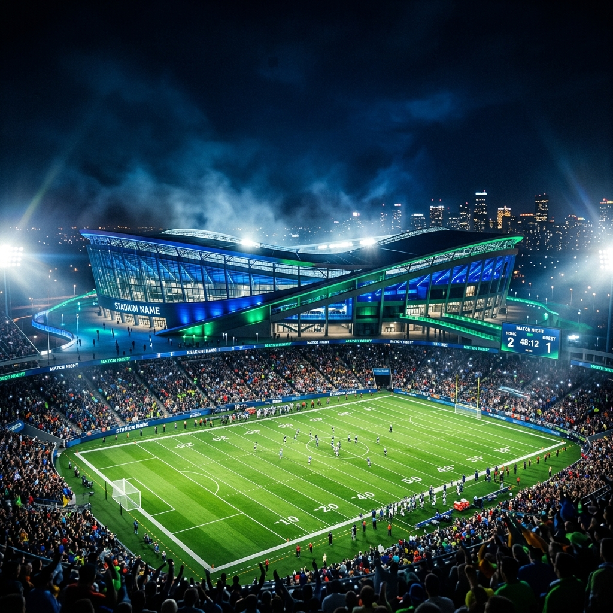

# 🏟️ Sportify — Premium Multi-Sports Arena Website

<p align="center">
  
</p>

<p align="center">
  <strong>A modern, premium, high-performance web experience for Sportify — built with Next.js 16 (App Router), React 19, TypeScript, and Tailwind CSS v4. Developed entirely through Vibe Coding using Antigravity AI.</strong>
</p>

<p align="center">
  <a href="https://cdasadiya.netlify.app">
    
  </a>
  <a href="https://www.linkedin.com/in/chaitanya-dasadiya">
    
  </a>
  
  
  
  
  
</p>

---

## 🎨 Visual Showcase & Screenshots

### 🌌 Desktop View (Default Dark Theme)
The layout uses a curated deep-blue slate background (`#020617`), vibrant emerald accents (`#10B981`), and soft orange details to capture the mood of a sports arena under direct night floodlighting.

| 🏟️ Hero Landing | 🏆 Tournament Hosting |
|:---:|:---:|
|  |  |

---

## ✨ Features & Sections

Sportify provides an interactive, scroll-reveal landing page configured for optimal conversions, speed, and mobile responsiveness.

### 🏠 Hero Landing Area
- **Staggered Animations**: Smooth stagger reveal of headlines, subheadings, and CTAs.
- **Floating Orbs**: Ambient CSS-animated glass gradient elements moving in the background.
- **Stats Row**: High-level counters (Happy members, facilities, pro coaches) to build immediate brand trust.

### 📖 About Us Section
- **Stat Cards**: Dynamic grid cards with individual hover-lift animations.
- **Featured Quote**: Styled quote layout highlighting the Sportify core values.

### 🏟️ Facilities & Services Grid
- **Service Cards**: Dynamic descriptions for Turf Booking, Tournament Hosting, Coaching Academies, Pool, and Athlete Canteen.
- **Intelligent CTAs**: Directs players to booking inquiries or pricing sections.
- **Status Tags**: Color-coded badges ("Most Booked", "Members Only", "New").

### 🏸 Availability & Sports Information
- **Timing & Schedule Breakdown**: Full grid details for Football, Cricket, Badminton, Tennis, and Swimming.
- **Synthetic surfaces details**: Highlights turf standards (FIFA, BWF, ITF-certified) to appeal to serious athletes.

### 🎁 Membership Selector
- **Monthly / Yearly Switcher**: Dynamic pricing toggle calculations with a highlighted **20% annual discount** tag.
- **Elite Card Glow**: Featured plan with custom linear gradient borders and a "Most Popular" flame icon badge.

### 📸 Responsive Masonry Gallery
- **Category Filter Tabs**: Sort photos instantly (Turf, Courts, Pool, Cafe, Events) without page reloads.
- **Lightbox Preview Modal**: Click-to-expand image modal backdrop blur with zoom controls.

### 💬 Testimonials Carousel
- **Auto-Play Slider**: Cycles reviews automatically every 7 seconds.
- **Drag & Nav Controls**: Prev/Next arrow buttons and indicator dot paginations.

### 🙋 FAQ Accordion
- **Collapsible Layout**: Chevron-animated accordion questions with smooth height transitions.

### 📧 Inquiry Form & Google Maps Integration
- **Validations**: Form verifies input before submission and triggers responsive success/error alerts.
- **Interactive Map**: Embedded Google Maps iframe centered around the Bengaluru Koramangala area.

---

## 🛠️ Technology Stack

| Technology | Purpose |
|---|---|
| **Next.js 16** | App Router framework, static prerendering, metadata optimization |
| **React 19** | Concurrent rendering support, components design |
| **Tailwind CSS v4** | Custom theme configuration, CSS custom properties, utility styling |
| **TypeScript** | Static type safety and autocomplete |
| **Framer Motion** | Staggered animations, scroll reveals, lightbox modals, collapses |
| **Lucide React** | Streamlined icon integrations |
| **Google Fonts** | Inter (body text) and Outfit (athletic headings) |

---

## 🚀 Quick Start Guide

### Prerequisites
- **Node.js** v18.17.0+
- **npm** v9+

### Installation & Local Run

```bash
# 1. Clone the repository
git clone https://github.com/cdasadiya/sportify_website.git
cd sportify_website

# 2. Install package dependencies
npm install

# 3. Start the Turbopack development server
npm run dev

# 4. Open in browser
# Navigate to http://localhost:3000
```

### Production Build

```bash
# Compile and optimize static pages
npm run build

# Start production server
npm run start
```

---

## 📁 Directory Structure

```text
sportify_website/
├── app/
│   ├── layout.tsx             # Root Layout with Font loaders & SEO Metadata
│   ├── page.tsx               # Main assembly page loading all sections
│   └── globals.css            # Global variables, imports, custom scrollbar
├── components/
│   ├── layout/
│   │   ├── Navbar.tsx         # Responsive sticky header with hamburger toggler
│   │   └── Footer.tsx         # Grid footer with inline SVG social icons
│   ├── sections/
│   │   ├── Hero.tsx           # Staggered header + floating gradient orbs
│   │   ├── About.tsx          # Stat grids + team quote card
│   │   ├── Services.tsx       # 5 core facility service cards
│   │   ├── SportsAvailable.tsx# Timings & standard descriptions of sports
│   │   ├── WhyChoose.tsx      # grid displaying 10 premium amenities
│   │   ├── Tournaments.tsx    # Details for tournament organizing
│   │   ├── MembershipPlans.tsx# Price cards + billing switcher toggle
│   │   ├── Gallery.tsx        # Masonry filter grid + lightbox modal
│   │   ├── Testimonials.tsx   # Auto-play client review carousel
│   │   ├── FAQ.tsx            # Animated accordion help desk
│   │   └── Contact.tsx        # Validated form + detailed contact cards + map
│   └── ui/
│       ├── Button.tsx         # Motion motion.button element
│       ├── Badge.tsx          # Pill tags for labels
│       └── SectionWrapper.tsx # Scroll reveal viewport wrapper
├── public/
│   └── images/                # Asset images (Gallery, Hero, Avatars)
├── requirements.txt           # Setup requirements list
├── package.json               # Node project manifest
└── README.md                  # Beautiful developer documentation
```

---

## 🤖 Built with Vibe Coding & Antigravity AI

Sportify was engineered entirely through **Vibe Coding** — a development methodology where you describe features in natural language and an AI coding agent (Antigravity) handles implementation, testing, and deployment.

### 🤖 What Antigravity Did Autonomously
- **Planned** the complete website layout and PRD parameters.
- **Wrote** all Next.js 16 components, custom React states, and global configurations.
- **Designed** the aesthetic dark glassmorphism styling, responsive color choices, and animation layouts.
- **Fixed** compilation type checks between React 19 HTML element signatures and Framer Motion prop-spreads.
- **Resolved** PostCSS order rules compliance within Tailwind CSS v4.
- **Tested** animations, forms, and toggles using browser sub-agents.
- **Pushed** the project directly to your remote repository on GitHub.

---

## 👤 Author

Made with ❤️ by **Chaitanya Dasadiya**

<p>
  <a href="https://www.linkedin.com/in/chaitanya-dasadiya">
    
  </a>
  &nbsp;
  <a href="https://github.com/cdasadiya">
    
  </a>
</p>

---

## 📜 License

This project is open-source and licensed under the [MIT License](https://opensource.org/licenses/MIT).
